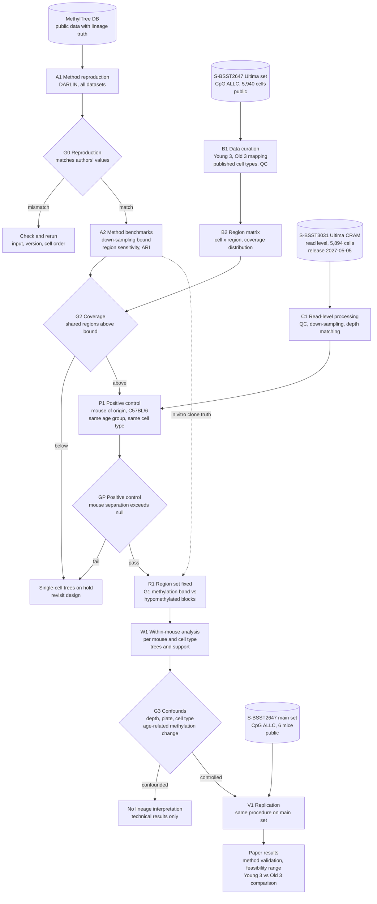
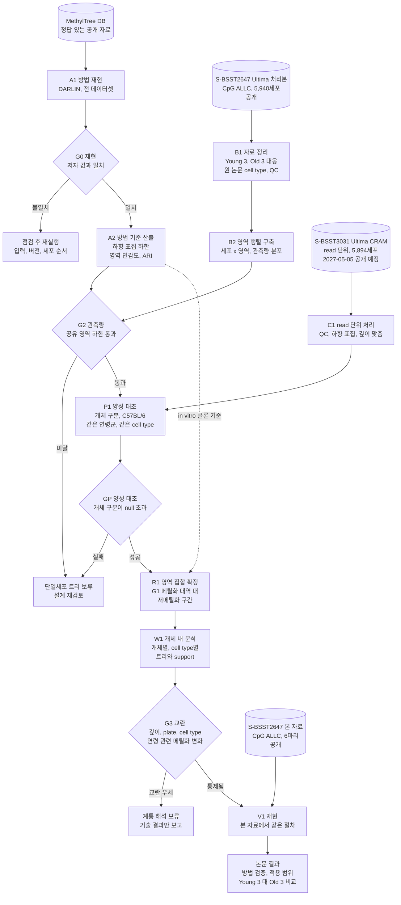

# Lineage_tracing-onboarding

## Workflow (en)

```mermaid
graph TD
    DB[("MethylTree DB<br/>public data with lineage truth")] --> A1["A1 Method reproduction<br/>DARLIN, all datasets"]
    A1 --> G0{"G0 Reproduction<br/>matches authors' values"}
    G0 -- "mismatch" --> FIX["Check and rerun<br/>input, version, cell order"]
    G0 -- "match" --> A2["A2 Method benchmarks<br/>down-sampling bound<br/>region sensitivity, ARI"]

    KU[("S-BSST2647 Ultima set<br/>CpG ALLC, 5,940 cells<br/>public")] --> B1["B1 Data curation<br/>Young 3, Old 3 mapping<br/>published cell types, QC"]
    B1 --> B2["B2 Region matrix<br/>cell x region, coverage distribution"]
    KC[("S-BSST3031 Ultima CRAM<br/>read level, 5,894 cells<br/>release 2027-05-05")] --> C1["C1 Read-level processing<br/>QC, down-sampling, depth matching"]

    A2 --> G2{"G2 Coverage<br/>shared regions above bound"}
    B2 --> G2
    G2 -- "below" --> STOP["Single-cell trees on hold<br/>revisit design"]
    G2 -- "above" --> P1["P1 Positive control<br/>mouse of origin, C57BL/6<br/>same age group, same cell type"]
    C1 --> P1
    P1 --> GP{"GP Positive control<br/>mouse separation exceeds null"}
    GP -- "fail" --> STOP
    GP -- "pass" --> R1["R1 Region set fixed<br/>G1 methylation band vs<br/>hypomethylated blocks"]
    A2 -. "in vitro clone truth" .-> R1
    R1 --> W1["W1 Within-mouse analysis<br/>per mouse and cell type<br/>trees and support"]
    W1 --> G3{"G3 Confounds<br/>depth, plate, cell type<br/>age-related methylation change"}
    G3 -- "confounded" --> HOLD["No lineage interpretation<br/>technical results only"]
    G3 -- "controlled" --> V1["V1 Replication<br/>same procedure on main set"]
    KM[("S-BSST2647 main set<br/>CpG ALLC, 6 mice<br/>public")] --> V1
    V1 --> OUT["Paper results<br/>method validation, feasibility range<br/>Young 3 vs Old 3 comparison"]
```

## Workflow (ko)

```mermaid
graph TD
    DB[("MethylTree DB<br/>정답 있는 공개 자료")] --> A1["A1 방법 재현<br/>DARLIN, 전 데이터셋"]
    A1 --> G0{"G0 재현<br/>저자 값과 일치"}
    G0 -- "불일치" --> FIX["점검 후 재실행<br/>입력, 버전, 세포 순서"]
    G0 -- "일치" --> A2["A2 방법 기준 산출<br/>하향 표집 하한<br/>영역 민감도, ARI"]

    KU[("S-BSST2647 Ultima 처리본<br/>CpG ALLC, 5,940세포<br/>공개")] --> B1["B1 자료 정리<br/>Young 3, Old 3 대응<br/>원 논문 cell type, QC"]
    B1 --> B2["B2 영역 행렬 구축<br/>세포 x 영역, 관측량 분포"]
    KC[("S-BSST3031 Ultima CRAM<br/>read 단위, 5,894세포<br/>2027-05-05 공개 예정")] --> C1["C1 read 단위 처리<br/>QC, 하향 표집, 깊이 맞춤"]

    A2 --> G2{"G2 관측량<br/>공유 영역 하한 통과"}
    B2 --> G2
    G2 -- "미달" --> STOP["단일세포 트리 보류<br/>설계 재검토"]
    G2 -- "통과" --> P1["P1 양성 대조<br/>개체 구분, C57BL/6<br/>같은 연령군, 같은 cell type"]
    C1 --> P1
    P1 --> GP{"GP 양성 대조<br/>개체 구분이 null 초과"}
    GP -- "실패" --> STOP
    GP -- "성공" --> R1["R1 영역 집합 확정<br/>G1 메틸화 대역 대<br/>저메틸화 구간"]
    A2 -. "in vitro 클론 기준" .-> R1
    R1 --> W1["W1 개체 내 분석<br/>개체별, cell type별<br/>트리와 support"]
    W1 --> G3{"G3 교란<br/>깊이, plate, cell type<br/>연령 관련 메틸화 변화"}
    G3 -- "교란 우세" --> HOLD["계통 해석 보류<br/>기술 결과만 보고"]
    G3 -- "통제됨" --> V1["V1 재현<br/>본 자료에서 같은 절차"]
    KM[("S-BSST2647 본 자료<br/>CpG ALLC, 6마리<br/>공개")] --> V1
    V1 --> OUT["논문 결과<br/>방법 검증, 적용 범위<br/>Young 3 대 Old 3 비교"]
```
