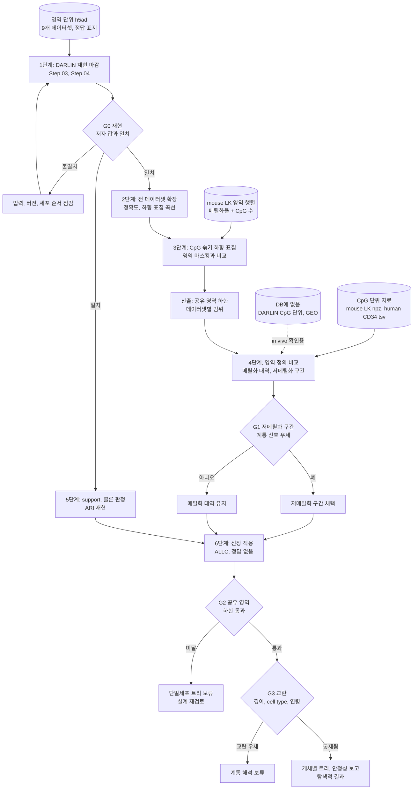

# Lineage_tracing-onboarding

## Workflow

```mermaid
graph TD
    H5[("영역 단위 h5ad<br/>9개 데이터셋, 정답 표지")] --> S1["1단계: DARLIN 재현 마감<br/>Step 03, Step 04"]
    S1 --> G0{"G0 재현<br/>저자 값과 일치"}
    G0 -- "불일치" --> FIX["입력, 버전, 세포 순서 점검"]
    FIX --> S1
    G0 -- "일치" --> S2["2단계: 전 데이터셋 확장<br/>정확도, 하향 표집 곡선"]
    G0 -- "일치" --> S5["5단계: support, 클론 판정<br/>ARI 재현"]
    MTX[("mouse LK 영역 행렬<br/>메틸화율 + CpG 수")] --> S3
    S2 --> S3["3단계: CpG 솎기 하향 표집<br/>영역 마스킹과 비교"]
    S3 --> B2["산출: 공유 영역 하한<br/>데이터셋별 범위"]
    CPG[("CpG 단위 자료<br/>mouse LK npz, human CD34 tsv")] --> S4
    GEO[("DB에 없음<br/>DARLIN CpG 단위, GEO")] -. "in vivo 확인용" .-> S4
    B2 --> S4["4단계: 영역 정의 비교<br/>메틸화 대역, 저메틸화 구간"]
    S4 --> G1{"G1 저메틸화 구간<br/>계통 신호 우세"}
    G1 -- "예" --> R1["저메틸화 구간 채택"]
    G1 -- "아니오" --> R2["메틸화 대역 유지"]
    R1 --> K["6단계: 신장 적용<br/>ALLC, 정답 없음"]
    R2 --> K
    S5 --> K
    K --> G2{"G2 공유 영역<br/>하한 통과"}
    G2 -- "미달" --> STOP["단일세포 트리 보류<br/>설계 재검토"]
    G2 -- "통과" --> G3{"G3 교란<br/>깊이, cell type, 연령"}
    G3 -- "교란 우세" --> HOLD["계통 해석 보류"]
    G3 -- "통제됨" --> OUT["개체별 트리, 안정성 보고<br/>탐색적 결과"]
```
